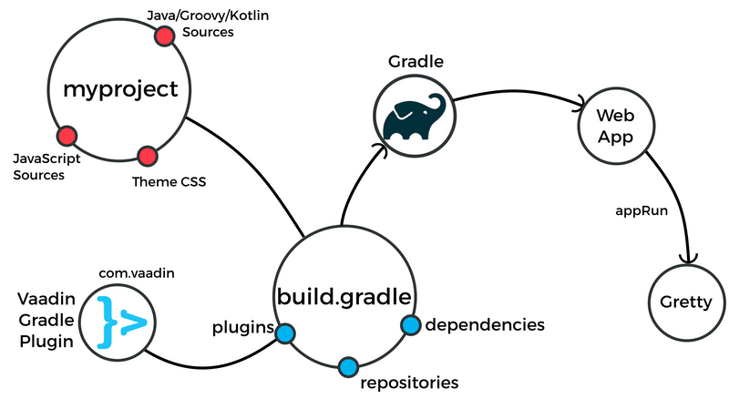

# Gradle 
## Difinition 
{:width="300px"}
Gradle est un outil d'automatisation de construction open-source largement utilisé dans le développement logiciel. Gradle est souvent désigné comme un "système de gestion de construction". Il est conçu pour simplifier et automatiser le processus de construction, de déploiement et de gestion de projets logiciels.
{:width="1000px"}